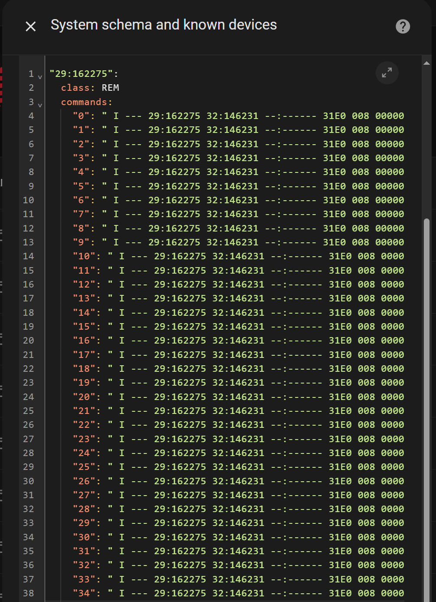
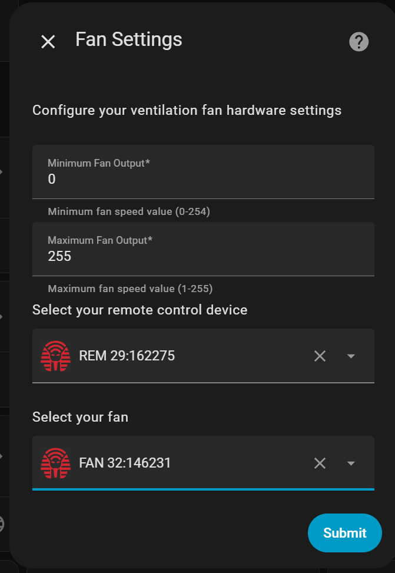
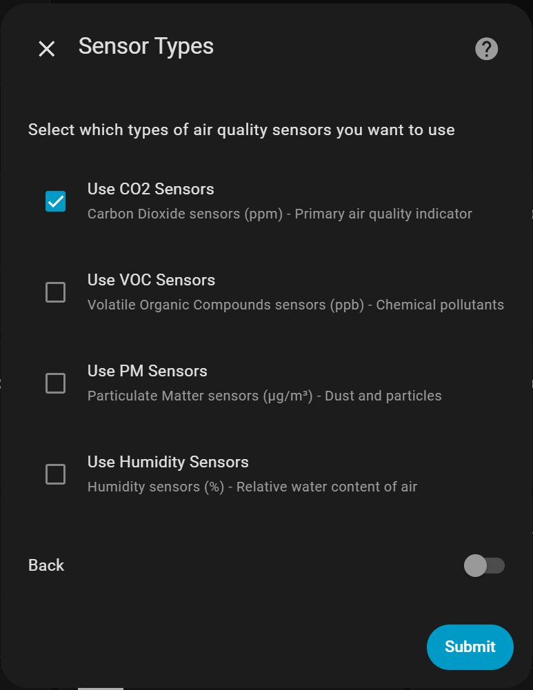
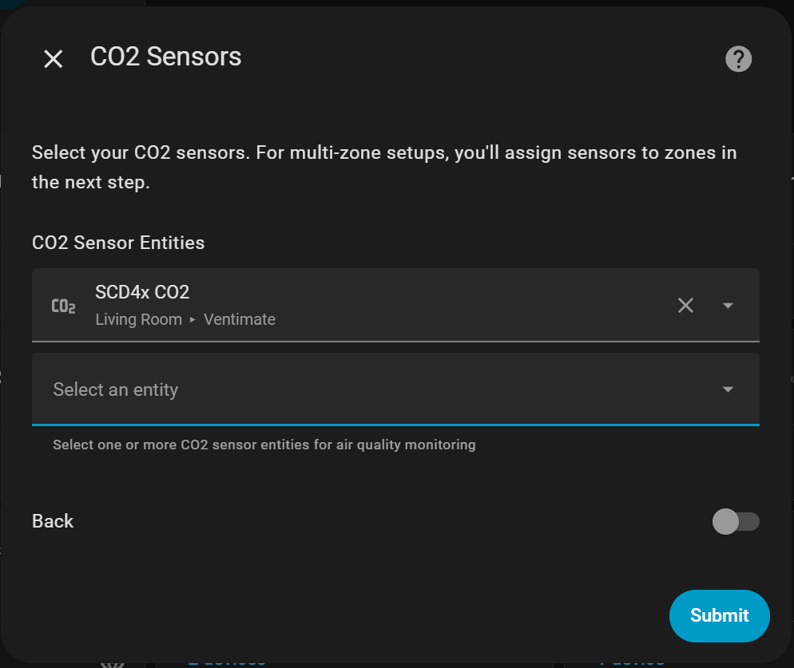
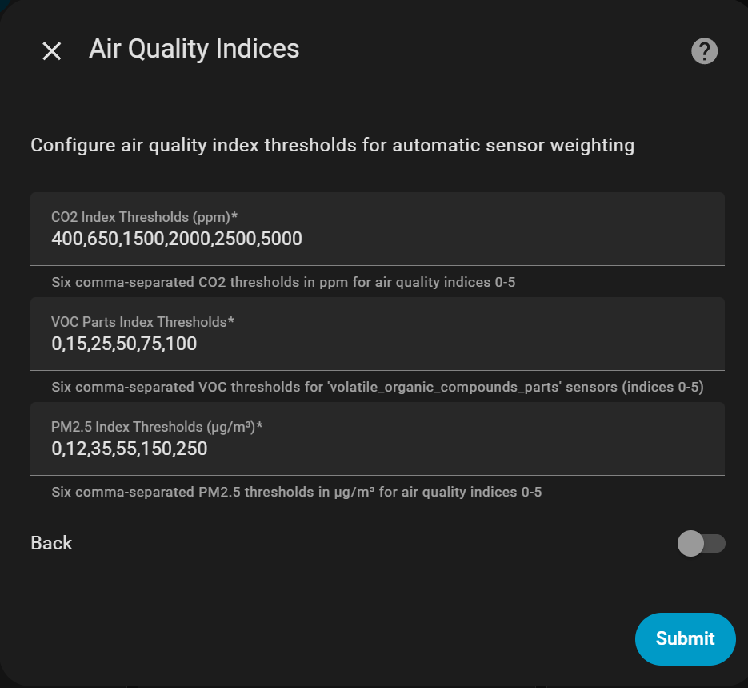
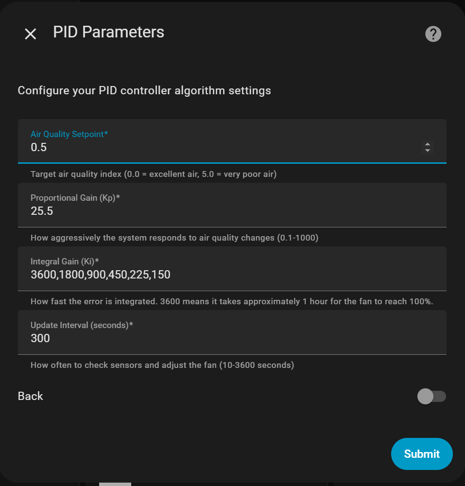

# Ventilation Controller CC

A custom Home Assistant component that automatically controls your Ramses RF ventilation unit based on real-time air quality measurements. The controller uses air quality sensors to calculate an index from 0 (excellent) to 5 (very poor) and adjusts fan speed accordingly.

## How to Use

### Step 1: Configure Ramses CC Commands
Add the integration commands to your Ramses CC schema:

1. Open the `commands.txt` file in a text editor like Notepad++
2. Replace the serial numbers in the commands with your actual device serial numbers:
   - Use Ctrl+F to find the existing serial numbers
   - Replace them with your remote and ventilation unit serial numbers
3. Copy all commands and paste them into the "commands" section of your remote in Ramses CC's "known devices" section

### Step 2: Install the Integration

#### Option A: Via Home Assistant Community Store (HACS) - Recommended

1. Make sure you have [HACS](https://hacs.xyz/) installed in your Home Assistant
2. In Home Assistant, go to **HACS** → **Integrations**
3. Click the **⋮** menu (three dots) in the top right corner
4. Select **Custom repositories**
5. Add the repository URL: `https://github.com/IMMRMKW/Ventilation_controller_cc`
6. Select **Integration** as the category
7. Click **Add**
8. Find "PID Ventilation Control" in the HACS integrations list and click **Download**
9. **Restart Home Assistant** after the download completes

#### Option B: Manual Installation

1. Navigate to your Home Assistant `custom_components` folder
2. Copy+Paste the folder called `ventilation` of this repository into your `custom_components` folder
3. **Restart Home Assistant**

### Step 3: Configure the Integration

1. Go to **Settings** → **Devices & Services** → **Add Integration**
2. Search for "PID Ventilation Control" and select it
3. Follow the configuration steps:

#### Fan Settings

Set the minimum and maximum fan output values. Use a lower maximum value if full power (255) is too loud.

#### Sensor Types

Select which types of air quality sensors you want to use. Toggle "back" and submit to return to the previous step.

#### Sensor Selection

Choose the specific sensor entities for each selected sensor type.

#### Air Quality Index Configuration

This step defines how sensor readings are converted to air quality indices (0-5). The controller uses the highest index from all sensors as the overall air quality.

For example, CO2 values:

- 400-650 ppm = Index 0 (excellent)
- 650-1500 ppm = Index 1 (good)
- And so on...

The default values are based on health guidelines and should work well for most setups. You can adjust them later if needed.

#### PID Controller Settings

Configure the control algorithm parameters:

- **Setpoint**: Target air quality index (recommend starting with 1.0)
- **Proportional Gain (Kp)**: How the fan power is linearly increase with increasing deviation of the air quality compared to your setpoint
- **Integral Gain (Ki)**: Six values controlling response time for each air quality level (represents approximate time to reach 100% fan speed). You can use the six numbers so the controller responds differently when the air quality is already quite good (index = 0) compared to when the air quality is poor (index = 5)
- **Update Interval**: How often to check sensors and adjust the fan (in seconds)

Note: Many ventilation systems only adjust every 10 minutes, so very short intervals may not improve responsiveness.

