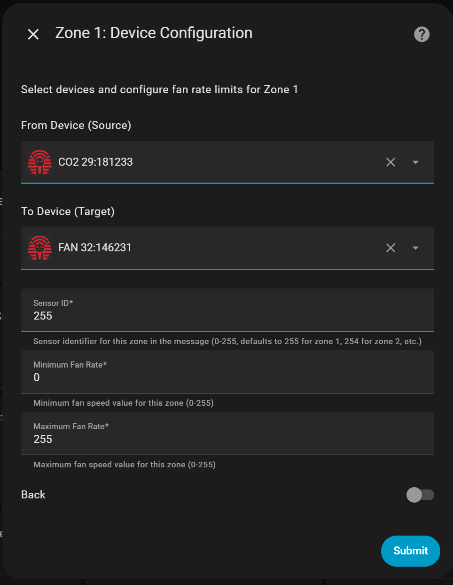
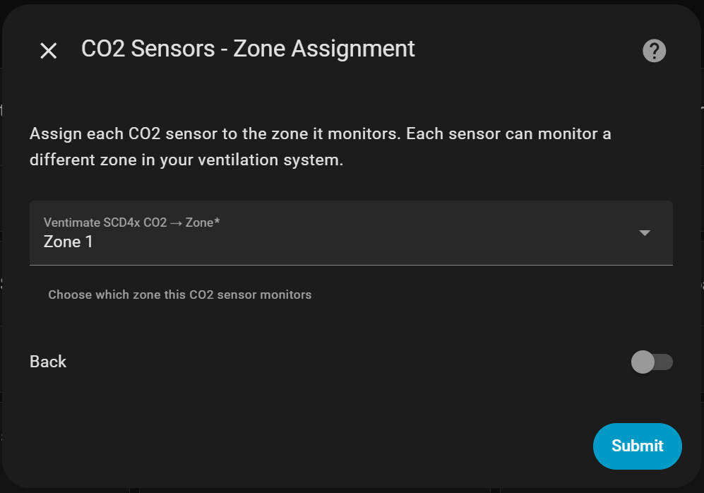
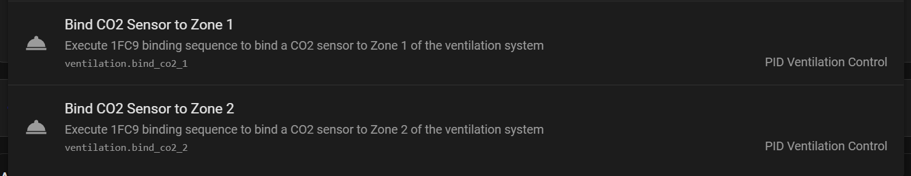

# Ventilation Controller CC

A custom Home Assistant component that automatically controls your Ramses RF ventilation unit based on real-time air quality measurements. The controller uses air quality sensors to calculate an index from 0 (excellent) to 5 (very poor) and adjusts fan speed accordingly.

**Supported Sensor Types:**

- CO2 (Carbon Dioxide)
- PM (Particulate Matter - PM1.0, PM2.5, PM10)
- VOC (Volatile Organic Compounds)
- Humidity

*Need support for other sensor types? Feel free to open an issue on GitHub!*

The controller supports multi-zone systems by mimicking a CO2 sensor for each zone, without interfering with existing sensors already bound to your ventilation box or zone controller. The current version uses fake remote devices to send commands to your ventilation system.

**Prerequisites:** This guide assumes you have already configured Ramses CC integration with a working remote device in Home Assistant.

## How to Use

### Step 1: Configure Ramses CC
Add the number of faked CO2 devices to your Ramses CC's "known devices" section equal to the number of zones in your ventilation system. Use device IDs that are logical. E.g., check your actual CO2 sensor's ID, and increment the last number for each zone. In the example below you see how I have one actual sensor, and two fake ones where I simply incremented the last digit. These sensors will later be used to send fan commands based on the current air quality.

```yaml
"29:181232":
  class: CO2
"29:181233":
  class: CO2
  faked: true
"29:181234":
  class: CO2
  faked: true
```

### Step 2: Install the Integration

#### Option A: Via Home Assistant Community Store (HACS) - Recommended

1. Make sure you have [HACS](https://hacs.xyz/) installed in your Home Assistant
2. In Home Assistant, go to **HACS** → **Integrations**
3. Click the **⋮** menu (three dots) in the top right corner
4. Select **Custom repositories**
5. Add the repository URL: `https://github.com/IMMRMKW/Ventilation_controller_cc`
6. Select **Integration** as the category
7. Click **Add**
8. Find "PID Ventilation Control" in the HACS integrations list and click **Download**
9. **Restart Home Assistant** after the download completes

#### Option B: Manual Installation

1. Navigate to your Home Assistant `custom_components` folder
2. Copy+Paste the folder called `ventilation` of this repository into your `custom_components` folder
3. **Restart Home Assistant**

### Step 3: Configure the Integration

1. Go to **Settings** → **Devices & Services** → **Add Integration**
2. Search for "PID Ventilation Control" and select it
3. Follow the configuration steps:

#### Remote selection and zone number

In the dropdown menus, select your remote controller and the number of zones your system uses. If you do not have a zone controller and have one ventilation unit, set zones to 1.


#### Zone Configuration

For each zone in your system, you'll configure the device communication and fan control settings:

- **From Device (Source)**: Select one of the fake CO2 sensor(s) that you previously created in your known devices list. Each fake sensor will act as if present in one of the zones.
- **To Device (Target)**: Select the fan controller or valve device for this specific zone
- **Sensor ID**: Identifier used in messages (defaults to 255 for zone 1, 254 for zone 2, etc.). This variable modifies the ramses rf message. Leave as is.
- **Min/Max Fan Rate**: Control the fan speed range for this zone (0-255)



#### Sensor Types

Select which types of air quality sensors you want to use. Toggle "back" and submit to return to the previous step.


#### Sensor Selection

Choose the specific sensor entities for each selected sensor type.


#### Sensor Zone Assignment

If you have multiple zones, assign each sensor to the zone it monitors. This allows the controller to adjust fan speeds independently for each zone based on local air quality conditions.



#### Air Quality Index Configuration

This step defines how sensor readings are converted to air quality indices (0-5). The controller uses the highest index from all sensors as the overall air quality.

For example, CO2 values:

- 400-650 ppm = Index 0 (excellent)
- 650-1500 ppm = Index 1 (good)
- And so on...

The default values are based on health guidelines and should work well for most setups. You can adjust them later if needed.


#### PID Controller Settings

Configure the control algorithm parameters:

- **Setpoint**: Target air quality index (recommend starting with 1.0)
- **Proportional Gain (Kp)**: How the fan power linearly increases with increasing deviation of the air quality compared to your setpoint
- **Integral Gain (Ki)**: Six values controlling response time for each air quality level (represents approximate time to reach 100% fan speed). You can use the six numbers so the controller responds differently when the air quality is already quite good (index = 0) compared to when the air quality is poor (index = 5)
- **Update Interval**: How often to check sensors and adjust the fan (in seconds)

Note: Many ventilation systems only adjust every 10 minutes, so very short intervals may not improve responsiveness.


### Step 4: Bind Sensors

Before the system will work, your ventilation box or zone controller must accept commands from the fake sensors you defined in Step 1. This requires a one-time binding process:

1. **Enable Pairing Mode**: Ensure your ventilation unit or zone controller is in pairing mode. Many systems automatically enter pairing mode for the first few minutes after startup, so a simple power cycle is usually sufficient.

2. **Execute Binding Functions**: In Home Assistant, navigate to **Developer Tools** → **Actions**. In the search bar, type "bind" and you'll find one binding function for each zone you configured (as shown in the image below).

3. **Perform Binding**: Execute each binding function once by selecting it and clicking **Perform Action**. Do this for all configured zones.

4. **Verify Success**: After binding, your system should accept messages from the fake sensors. You can confirm successful binding by checking the Ramses CC log file for message exchanges during the binding process.



### Step 5: Setup Complete

After completing all configuration steps, your ventilation controller is ready! The integration will:

1. **Monitor** your selected air quality sensors continuously
2. **Calculate** an overall air quality index (0-5) for each zone
3. **Control** fan speeds automatically using the PID algorithm
4. **Adjust** each zone independently based on local sensor readings

You can monitor and adjust the system through:
- **Settings** → **Devices & Services** → **PID Ventilation Control** (to reconfigure)
- **Developer Tools** → **States** (to see current sensor values and fan outputs)